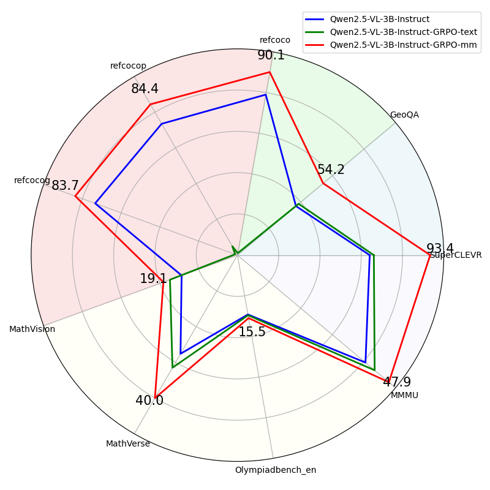

# OpenV-R1: An Open and Generalizable Large Vision-Language Model enhanced by Reinforcement Learning

## 🎯Overview

<!-- Inspired by the powerful reasoning capabilities of [DeepSeek R1](https://arxiv.org/abs/2501.12948) in the text domain, we aim to transfer the large-scale RL techniques that work well for LLMs to multimodal scenarios. 

Since visual perception tasks involve many aspects, we mainly focus on visual recognition and positioning as well as reasoning tasks. The motivation behinds this is that visual perception is used to identify and extract visual information, and LLM's powerful reasoning ability is used to solve the problem. The combination of the two can solve complex multimodal reasoning tasks. To this end, we conducted the following explorations:

- We train Qwen2.5-VL-3B-Instruct on text-only dataset [OpenV-R1 Training Text Dataset](https://huggingface.co/datasets/minglingfeng/Openv_R1_collected_text_data) using GRPO with a rule-based reward function. 
- We train Qwen2.5-VL-3B-Instruct on visual dataset [OpenV-R1 Training Visual Dataset](https://huggingface.co/datasets/minglingfeng/Openv_R1_collected_text_data) using GRPO with a rule-based reward function.
- We train Qwen2.5-VL-3B-Instruct on multimodel data combined with the above two. We will relase the results soon. -->


Inspired by the robust reasoning capabilities demonstrated by [DeepSeek R1](https://arxiv.org/abs/2501.12948)  in the text domain, we seek to extend the large-scale reinforcement learning (RL) techniques that have proven effective for large language models (LLMs) to multimodal scenarios.

Given the multifaceted nature of visual perception tasks, our focus centers on two critical components: visual recognition and positioning, as well as reasoning tasks. This approach is motivated by the complementary strengths of visual perception—which identifies and extracts visual information—and the advanced reasoning capabilities of LLMs, which are adept at problem-solving. By integrating these two modalities, we aim to address complex multimodal reasoning challenges. To achieve this, we conducted the following experiments:

- **Text-Only Training**: We trained Qwen2.5-VL-3B-Instruct on the [OpenV-R1 Training Text Dataset](https://huggingface.co/datasets/minglingfeng/Openv_R1_collected_text_data) using Goal-Specific Reward Optimization (GRPO) with a rule-based reward function.

- **Visual-Only Training**: We trained Qwen2.5-VL-3B-Instruct on the [OpenV-R1 Training Visual Dataset](https://huggingface.co/datasets/minglingfeng/Openv_R1_collected_visual_data) using GRPO with a rule-based reward function.

- **Multimodal Training**: We are training Qwen2.5-VL-3B-Instruct on a combined dataset integrating both text and visual data. The results of these experiments will be released in the near future.

This systematic exploration aims to evaluate the efficacy of GRPO in enhancing multimodal reasoning capabilities and to provide insights into the interplay between visual and textual modalities in complex reasoning tasks.

🔥We open-source our complete pipeline to foster further research in this area. We release all our codes, model, data. 
- [🤗 OpenV-R1-3B-Instruct](https://huggingface.co/minglingfeng/OpenV_R1_3B_Instruct)

- [🤗 OpenV-R1 Training Visual Dataset](https://huggingface.co/datasets/minglingfeng/OpenV_R1_collected_visual_data)

- [🤗 OpenV-R1 Training Text Dataset](https://huggingface.co/datasets/minglingfeng/Openv_R1_collected_text_data)

> [!NOTE] 
> These data are from the open source community and are obtained through cleaning and filtering.


---

### 🚀 News
- 2025-03-10: We release the OpenV-R1 repo, including codebase, model, and training datasets.

---

### 🗞️ Our Findings



- **Excellent Cross-Modal Reasoning Ability**: In our experiments, training exclusively with text-only data led to varying degrees of performance improvement on reasoning-related tasks, such as geometric reasoning and mathematical problem-solving. This highlights the potential of incorporating textual inference data to enhance the VLM model's reasoning capabilities. Furthermore, improvements were also observed in counting tasks and general-purpose tasks, suggesting that the enhanced reasoning abilities can generalize to broader applications. However, this approach came at a cost: the model's performance on tasks requiring strong visual perception significantly declined. For example, in the Grounding task (refcoco/+/g), the average performance plummeted from 75.3 to 2.4. This underscores a trade-off, indicating that while GRPO can strengthen specific capabilities, it may inadvertently impair other critical aspects of the model.
- **Diverse Data Achieves Better Performances**: When trained with visual data, the model exhibited substantial performance gains across a wide range of tasks, including counting, geometric reasoning, grounding, mathematical problem-solving, and general-purpose tasks. This demonstrates the importance of multimodal training in achieving balanced and comprehensive improvements across diverse domains.


## 📦 Setup

```bash
conda create -n openv_r1 python=3.11 
conda activate openv_r1

bash setup.sh
```

> [!NOTE] 
> If you meet bug when running the script, first try align your environments with `./src/requirements.txt`


## 🔄 Training

### Data Preparation
You can download our training data from [OpenV_R1_collected_visual_data](https://huggingface.co/datasets/minglingfeng/OpenV_R1_collected_visual_data) and [OpenV_R1_collected_text_data](https://huggingface.co/datasets/minglingfeng/OpenV_R1_collected_text_data).

### GRPO
- ./src/scripts/run_grpo_qwen2d5vl.sh
- ./src/scripts/run_grpo_vllm_qwen2d5vl_openv_r1_visual_data.sh

```bash
cd src/r1-v

HF_DATASET="minglingfeng/OpenV_R1_collected_visual_data" 

export FORMAT_REWARD_FACTOR=1.0
export IS_LOCAL=False ## load_from_disk or load_dataset from huggingface: minglingfeng/OpenV_R1_collected_visual_data
export DEBUG_MODE="true"
export LOG_PATH=./src/logs/debug_qwen2p5_vl_3b_${HF_DATASET}.log
# export WANDB_API_KEY="xxxxx"
export WANDB_PROJECT="OpenV-R1"

QWEN_PATH=/global_data/mllm/minglingfeng/models/Qwen2.5-VL-3B-Instruct
OUTPUT_DIR=./src/r1-v/src/outputs/exp-Qwen2.5-VL-3B/${HF_DATASET}
if [ ! -d "$OUTPUT_DIR" ]; then
 mkdir -p "$OUTPUT_DIR"
fi
RUN_NAME=3B-$HF_DATASET
DS_CONFIG="./src/r1-v/local_scripts/zero1_no_optimizer.json"  # Note that other zero setting would meet bugs related to vllm at current stage.

# vLLM NOTE: you are expected to use X + 1 cards for X training proc and 1 vLLM proc 
# e.g., the visible devices should be 0,1,2,3,4 for 5 cards, and  --nproc_per_node="4"

CUDA_VISIBLE_DEVICES="0,1,2,3,4,5,6,7" torchrun \
    --nproc_per_node="7" \
    --nnodes="1" \
    --node_rank="0" \
    --master_addr="127.0.0.1" \
    --master_port="12345" \
    ./src/r1-v/src/open_r1/grpo.py \
    --use_vllm true \
    --output_dir ${OUTPUT_DIR} \
    --model_name_or_path ${QWEN_PATH} \
    --dataset_name ${HF_DATASET} \
    --max_prompt_length 1024 \
    --max_completion_length 2048 \
    --per_device_train_batch_size 1 \
    --gradient_accumulation_steps 4 \
    --learning_rate 1e-6 \
    --lr_scheduler_type "constant" \
    --logging_steps 1 \
    --bf16 true \
    --gradient_checkpointing true \
    --attn_implementation flash_attention_2 \
    --min_pixels 3136 \
    --max_pixels 501760 \
    --num_train_epochs 2 \
    --run_name ${RUN_NAME} \
    --save_steps 50 \
    --save_total_limit 3 \
    --save_only_model true \
    --report_to wandb \
    --temperature 1.0 \
    --vllm_device "cuda:7" \
    --vllm_gpu_memory_utilization 0.8 \
    --deepspeed ${DS_CONFIG} \
    --num_generations 7 
    # number of outputs G in grpo, reduce it would lead to faster training and smaller memory cost but higher variance 

```

> [!NOTE] 
> 1. To reproduce the result, keep the per_device_train_batch_size to 1 for now, as there is a revealed bug about batched training. 
> 2. If you meet **OOM Error**, you can try reduce `--num_generations` or set `gradient_checkpointing` as `true`.


### SFT

We also provide SFT code, please follow the script and edit the config to customize the sft task.

```bash
accelerate launch --config_file src/r1-v/configs/zero2.yaml src/r1-v/src/open_r1/sft.py --config src/r1-v/configs/qwen2vl_sft_config.yaml 
```

## 🧪 Evaluation


| Model       | SuperCLEVR       |GEOQA       |RefCOCO/+/g AVG     |MathVision       |MathVerse       |OlympiadBench       |MMMU       |
|:-----------|:-----------:|:-----------:|:-----------:|:-----------:|:-----------:|:-----------:|:-----------:|
| Qwen2.5-VL-3B-Instruct   |64.1    |37.0    |75.3    |14.4    |27.6    |14.6    |40.5    |
| Qwen2.5-VL-3B-Instruct-GRPO-text   | 66.1   |38.7    |2.4    |17.4   |31.5    |14.8    |43.4    |
| Qwen2.5-VL-3B-Instruct-GRPO-vis   | 93.4   | 54.2   |86.1    |19.1    |40.0    |15.5    |47.9    |

### Counting: SuperCLEVR

```bash
cd ./src/eval/data
wget https://www.cs.jhu.edu/~zhuowan/zhuowan/SuperCLEVR/to_be_released/images.zip
unzip images.zip

# change image dir and the model path in the scripts
python ./src/eval/test_qwen2d5vl_counting_superclevr_5k.py

```

### Geo Reasoning: GEOQA

We provide the example script to evaluate on the test set (direct answer form) of [GEOQA](https://arxiv.org/abs/2312.11370).


```bash
# prepare images for testing
cd ./src/eval/data
git lfs install
git clone https://huggingface.co/datasets/Luckyjhg/Geo170K
cd Geo170K
unzip images.zip


# change image dir and the model path in the scripts
python ./src/eval/test_qwen2d5vl_geoqa.py

# To enable faster inference with multiple GPUs, you could also use the script in 
python ./src/eval/test_qwen2d5vl_geoqa_multigpu.py
```

### Referring Expression Comprehension (REC): RefCOCO/+/g
> 1. Download the [COCO Train2014 image](https://huggingface.co/datasets/omlab/VLM-R1/resolve/main/train2014.zip) and unzip it, and we refer to the image dir as `<your_image_root>`.

> 2. Download the [RefCOCO/+/g Annotation files](https://huggingface.co/datasets/omlab/VLM-R1/resolve/main/rec_jsons_processed.zip) and unzip it.

```bash
# Remember to change the model path, image root, and annotation path in the script
python ./src/eval/test_qwen2d5vl_rec.py
```

### Math: MathVision, MathVerse, and OlympiadBench
```bash
# Remember to change the model path, image root, and annotation path in the script
python ./src/eval/test_qwen2d5vl_mathvision_multigpu.py
python ./src/eval/test_qwen2d5vl_mathverse_multigpu.py
python ./src/eval/test_qwen2d5vl_olympiadbench_multigpu.py
```
> [!NOTE] 
> The models are evaluated in the zero-shot setting and with an extracted matching approach, which corresponds to the rule-based reward in training stage.

### General: MMMU
```bash
python ./src/eval/test_qwen2d5vl_mmmu.py
```

## 📋️ TODO
- Training with the combined data
- Synthesize more high-quality and diverse multimodal data
- Scale up to larger models and more general tasks

## 🤝 Acknowledgements

We sincerely thank [DeepSeek](https://github.com/deepseek-ai/DeepSeek-R1), [Open-R1](https://github.com/huggingface/open-r1), [QwenVL](https://github.com/QwenLM/Qwen2.5-VL), [Open-R1-Multimodal](https://github.com/EvolvingLMMs-Lab/open-r1-multimodal), [R1-V](https://github.com/Deep-Agent/R1-V) (our initial codebase), [VLM-R1](https://github.com/om-ai-lab/VLM-R1), [CLEVR](https://cs.stanford.edu/people/jcjohns/clevr/), [SuperCLEVR](https://github.com/Lizw14/Super-CLEVR), [G-LLAVA](https://arxiv.org/abs/2312.11370), and [RefCOCO](https://github.com/lichengunc/refer) for providing open source resources and to build the project. 


## 📚 Contributors and Citation

Contributors: [Lingfeng Ming](https://scholar.google.com/citations?user=QOMvlswAAAAJ&hl=zh-CN), Youwei Zhang, [Yadong Li](https://scholar.google.com/citations?user=VLfXcYIAAAAJ&hl=en), Song Chen, Jianhua Xu. 

If you find this work useful, please cite it as follows:
```bib
@misc{ming2025openvr1,
  author       = {Lingfeng Ming, Youwei Zhang, Yadong Li, Song Chen, Jianhua Xu, Zenan Zhou, Weipeng Chen},
  title        = {OpenV-R1: An Open and Generalizable Large Vision-Language Model enhanced by Reinforcement Learning},
  howpublished = {\url{https://github.com/fengzi258/OpenV-R1}},
  note         = {Accessed: 2025-03-10},
  year         = {2025}
}
```


